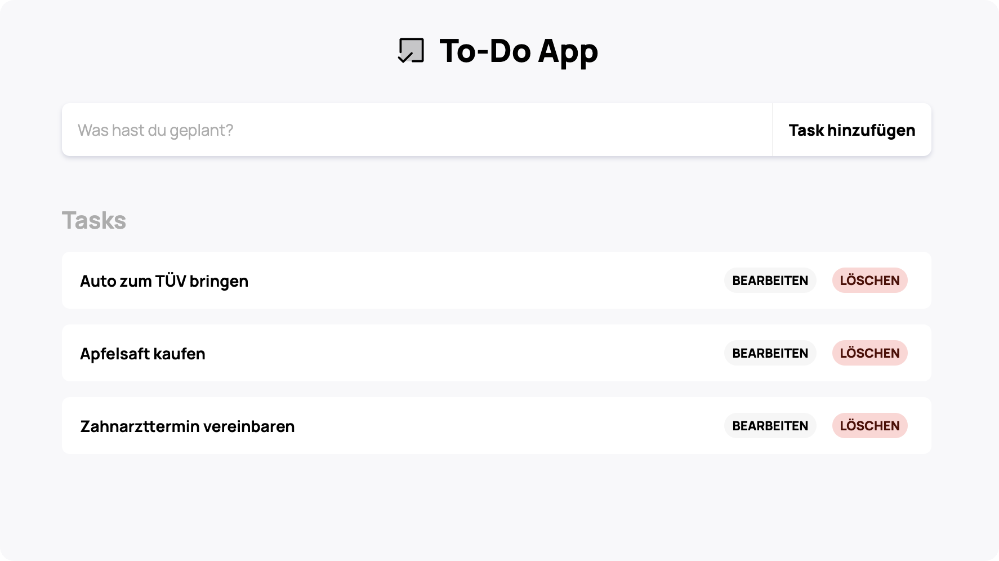

# 01 To-Do-App

Um einfache Konzepte in React zu üben, soll eine To-Do Web-App implementiert werden.

### Installation

1. Erstellen Sie eine lokale Kopie:
```sh
git clone
```

2. Installieren Sie alle notwendigen Packete:
```sh
npm install
```

3. Starten Sie den Development-Server (verfügbar unter `http://localhost:3000`)
```sh
npm start
```


### Funktionen

- Neue To-Do-Einträge hinzufügen
- To-Do-Einträge löschen
- To-Do-Einträge bearbeiten

### Mögliche Weitere Features (optional)

- To-Do-Einträge als erledigt markieren (z.B. mit einem Doppelklick)
- Alle erledigten To-Do-Einträge auf einmal löschen
- To-Do-Elemente im lokalen Speicher beibehalten

### Quellen

- https://eloquentjavascript.net/
- https://www.youtube.com/watch?v=MkESyVB4oUw&t=2010s
- https://www.w3schools.com/js/default.asp

### Screenshots

<div style="text-align:center">
  
</div>
